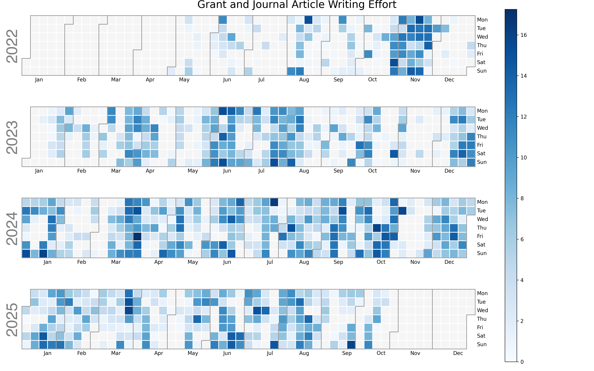

[](https://opensource.org/licenses/MIT)

# Heatmap of hours spent writing grant applications and journal articles

## Problem addressed

I wanted an automated way to sum up the effort I had expended on various writing projects in the form of a heatmap.
The heat map of commits to GitHub is motivating in terms of encouraging frequent commits.
I can gain a similar motivational driving force by displaying in public a heat map of hours spent working on journal articles per day.
I started posting this on December 4, 2024.
Time will tell if this practice makes a difference.



## Why is this useful?

Comparing multiple years reveals seasonal patterns.
The heat map also reveals periods when I have great difficulty completing my daily writing.
For me, this happens when I am collecting X-ray diffraction data around the clock for several days and preparing multiple presentations concurrently.
This identifies an area where I need to develop better self-regulation mechanisms, like not committing to two talks in the same two-week period.
I can generally maintain my writing schedule despite teaching, traveling to attend scientific conferences, attending these conferences, and serving on Grant review panels.

According to [research by Robert Boice in the 1980s](https://www.sciencedirect.com/science/article/abs/pii/0005796789901447), academics who record their writing effort are four times more productive than those who do not.
Academics who share their writing progress with colleagues are nine times more productive.

I started my database 2022 May 1. 
I wrote and deployed `hmj.py` in November 2023.
It made a difference in terms of expended effort in 2024 compared to 2023.
Script `hmgj.py` combines grant and journal writing effort.


## How it works

1. I track time spent on various projects by project number and project directory name in an SQLite database, `my time.db`. I view and edit this database with DB Browser for Sqlite. The schema for the database table `zTimeSpent` is given below for reproducibility.
2. `hmj.py` reads the database file and searches for journal article entries by project number. Mine are in the range of 1 to 999. It sums the hours spent per day and generates the heatmap via matplotlib.
3. A cron job to run `./hmj.py` every morning at 4:00 a.m. I stare at the displayed image and then get back to writing.

### SQL code to generate the table zTimeSpent

```sql
CREATE TABLE "zTimeSpent" (
	"id"	INTEGER NOT NULL,
	"DateDashed"	DATE,
	"Start"	TIME,
	"End"	TIME,
	"TimeClock"	TIME GENERATED ALWAYS AS (strftime('%H:%M', CAST((julianday("End") - julianday("Start")) AS REAL), '12:00')) VIRTUAL,
	"TimeHr"	REAL GENERATED ALWAYS AS (ROUND((julianday("End") - julianday("Start")) * 24, 2)) VIRTUAL,
	"ProjectID"	INTEGER,
	"ProjectDirectory"	TEXT,
	"Description"	TEXT,
	"Activity"	TEXT DEFAULT 'none',
	PRIMARY KEY("id")
);
```

## Installation

1. Assign project numbers to projects in a separate database or spreadsheet. I also use these numbers to start the names of project folders on my home directory to ease navigation on the command line. Your home folder can hold over 10,000 files. There is no need to use `Documents`.
2. Edit the file paths in hmj.py to fit your workflow.
3. Install the required Python packages. Take care that matplotlib is not yet being built in Python 3.13. I use Python 3.11. The Python modules `calmap` and `calplot` will likely need to be installed using 'pip'. It may be best to use a `conda` or `pyenv` environment to avoid the Python dependency nightmare at the expense of wasting disk space with redundant files.
4. If you wish, set up a cron job to run hmj.py every morning and display the heatmap.

The cron job calls the following zsh alias. I am using a `pyenv` environment made with Python3.11 installed with `home brew`.

```bash
alias hmj='cd ~/6003TimeTracking/cb && source python311-env/bin/activate && ./python311-env/bin/python3.11 hmj.py && deactivate && echo "Run hmj.py and show total effort as a heatmap."'
```

To post the updated `hmj.png` file on GitHub, I extend the `hmj` alias as follows: 

```bash
hmj='cd ~/6003TimeTracking/cb && source python311-env/bin/activate && ./python311-env/bin/python3.11 hmj.py && deactivate && cp hmj.png ~/6112MooersLabGitHubLabRepos/writing-timespent-heatmap/images/. && cd  ~/6112MooersLabGitHubLabRepos/writing-timespent-heatmap && gac images/hmj.png "Updated." && git push && echo "Run hmj.py that shows a series of heatmaps by effort."'
```

Here, `gac` is a bash function because I prefer entering one command over two:

```bash
gac () {
	echo "Function to git add a file and then commit the changes with a message."
	echo "Takes the name of a file and the message in a string."
	echo "Must set up a repository before using this function."
	if [ $# -lt 2 ]
	then
		echo "$0: not enough arguments" >&2
		echo "Usage: gca filename 'message about the commit'"
		return 2
	elif [ $# -gt 2 ]
	then
		echo "$0: too many arguments" >&2
		echo "Usage: gca filename 'message about the commit'"
		echo "Note absence of file extension .tex"
		return 2
	fi
	git add "$1"
	git commit -m "$2" "$1"
}
```

## Related site
mooerslab/writing-time-splitbox-heatmap

## Update history

|Version      | Changes                                                                                                                                  | Date                 |
|:------------|:---------------------------------------------------------------------------------------------------------------------------------------- |:---------------------|
| Version 0.1 |   Added badges, funding, and update table.  Initial commit.                                                                              | 2024 December 4      |
| Version 0.2 |   Light editing of the README.md file.                                                                                                   | 2024 December 16      |
| Version 0.3 |   Add code for database table. Combined grant and journal article writing effort.                                                        | 2025 June 22      |

## Sources of funding

- NIH: R01 CA242845
- NIH: R01 AI088011
- NIH: P30 CA225520 (PI: R. Mannel)
- NIH: P20 GM103640 and P30 GM145423 (PI: A. West)

