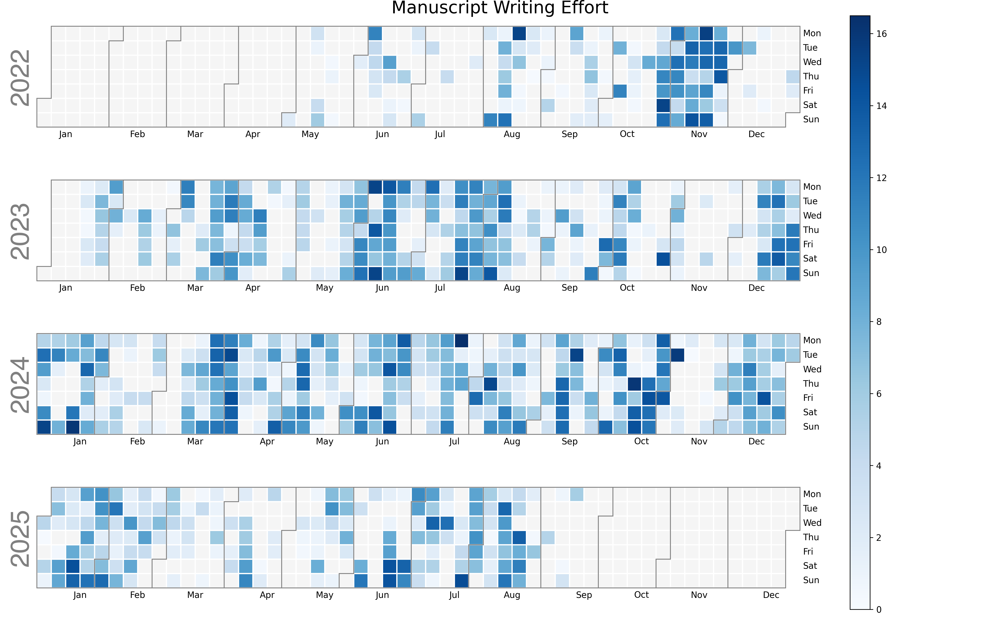

# Heatmap of hours spent writing journal articles

## Problem addressed

I wanted an automated way of summing up the effort that I had expended on various writing projects in the form of a heatmap.
I find the heat map of commits to GitHub to be motivating in terms of trying to make frequent commits.
I thought I could pick up a similar motivational driving force by generating a heat map of hours spent working on journal articles per day.

## How it works

1. I track my time spent on various projects by project number and project directory name in mytime.db.
2. I set up a Cron job to run `./hmj.py` every morning at 4:00 a.m.

## Installation

1. 

## Update history

|Version      | Changes                                                                                                                                                                         | Date                 |
|:-----------|:------------------------------------------------------------------------------------------------------------------------------------------|:--------------------|
| Version 0.1 |   Added badges, funding, and update table.  Initial commit.                                                                                                                | 2024 December 4  |

## Sources of funding

- NIH: R01 CA242845
- NIH: R01 AI088011
- NIH: P30 CA225520 (PI: R. Mannel)
- NIH: P20 GM103640 and P30 GM145423 (PI: A. West)
File
